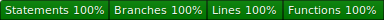

[](coverage-badge.svg)

# coveradge

***This project is not yet complete!***

## Installation

```
npm i coveradge
```

## To-dos

1. Complete existing code
2. Add coverage (including badge) to this repo
