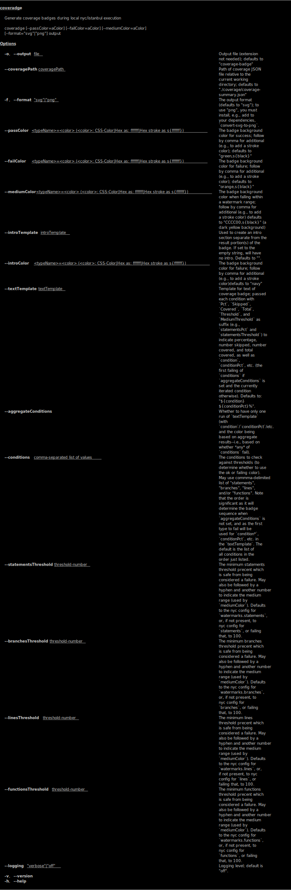

<!--
[](coverage-badge.svg)
-->

[](https://issuehunt.io/r/brettz9/coveradge)

# coveradge

## Installation

If you need png export, run:

```
npm i -D coveradge convert-svg-to-png
```

Otherwise, just this:

```
npm i -D coveradge
```

## Usage

1. Ensure you have at least the following `reporter` in your `package.json`:

```json
"nyc": {
  "reporter": [
    "json-summary"
  ]
}
```

2. Add a call to `coveradge` in your `package.json` `scripts` at some point
    after running `nyc`.

3. Add the badge to your README (e.g., `[](coverage-badge.svg)`) or for a link that will also work on npmjs.com: `[](coverage-badge.svg)`

That's it!

## Options

[](cli.svg)

## See also

- Locally generated Mocha test result badges
  - [mocha-badge-generator](https://github.com/ianpogi5/mocha-badge-generator) (MIT)
  - [mocha-reporter-badge](https://github.com/albanm/mocha-reporter-badge) (MIT)
- Generate badges of license types (e.g., by permissiveness)
  - [license-badger](https://github.com/brettz9/license-badger)

## To-dos

1. Option to change color if meeting user-chosen nyc thresholds (e.g., 100%)
1. Add tests and coverage (including badge commented out above) to this repo
